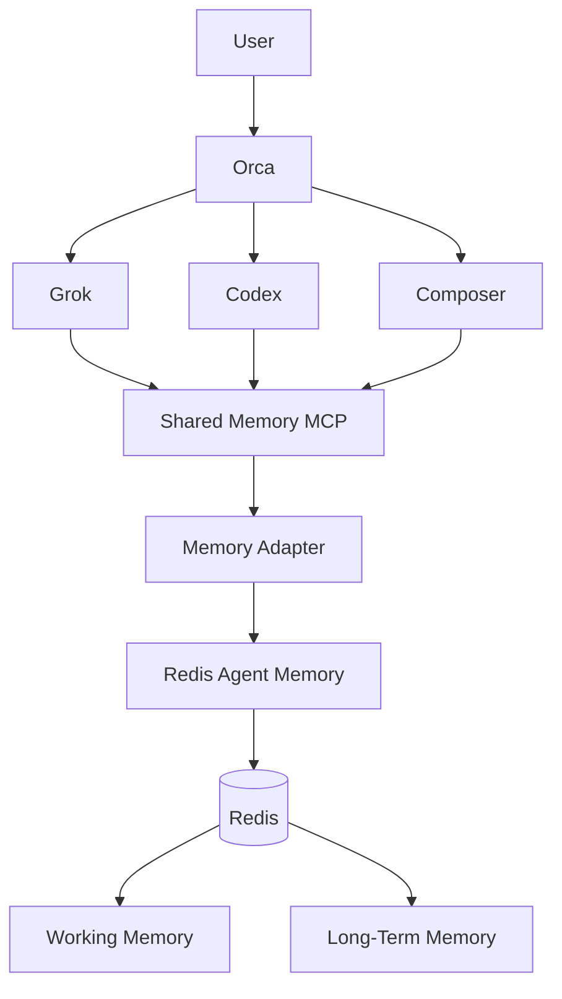

# Shared Agent Memory

Model-agnostic, project-isolated memory for Orca, Codex, Grok, and Cursor
Composer. Agents use one authenticated MCP interface; the implementation hides
Redis Agent Memory behind an `AgentMemoryProvider` seam.

> **SOURCE CODE > MEMORY**
>
> The repository is the source of truth. Shared memory provides historical and
> contextual knowledge. If they disagree, trust the current repository, verify
> whether the memory is stale, and update or supersede it.

## Architecture



Responsibilities stay separate:

- Orca owns runs, tasks, dispatch, worker state, and coordination.
- Git and the repository own current implementation truth.
- Redis Agent Memory owns persistent contextual knowledge.
- `shared-memory` defines the recall/write/handoff protocol.
- MCP provides a common model-independent interface.

The application module exposes a small `AgentMemoryProvider` interface. The
current `RedisAgentMemoryAdapter` maps it to the legacy V0 REST contract. Agents
never see Redis keys, Redis commands, V0 endpoints, or provider-specific tool
names. A future Redis Iris adapter can replace it without changing agent MCP
configuration or the global skill.

## Provider status and versions

Verified on 2026-08-25/26:

| Surface | Pinned/verified version | Intended use |
|---|---:|---|
| Redis Agent Memory Data Plane | OpenAPI `1.0.0` | Current supported Cloud/Iris contract |
| Redis Agent Memory Python SDK | `redis-agent-memory 0.2.1` beta | Managed client reference |
| OSS Agent Memory Server | `0.15.2` | Local development only; V0 research foundation |
| Ollama | `0.32.5` | Local generation and embeddings |
| Generation model | `qwen3:8b` | Local extraction/summarization |
| Embedding model | `nomic-embed-text` | Local 768-dimensional semantic vectors |
| MCP TypeScript SDK | `1.30.0` | Shared Streamable HTTP MCP |
| Node.js | `>=20`; image `24.18` | Adapter/MCP runtime |

The Compose stack deliberately pins V0 `0.15.2`. Redis no longer positions V0
as a supported production path. Production should use Redis Iris/Cloud through
a provider adapter, TLS, a secret manager, rate limiting, network policy, and
provider/store-scoped authorization. See the primary-source
[discovery report](docs/discovery/redis-agent-memory.md).

## Quick start

Prerequisites: Docker Desktop, Node.js 20+, `jq`, `openssl`, and Ollama. The
default local path does not require an OpenAI key. The setup wizard starts the
Ollama Homebrew service when available and pulls `qwen3:8b` plus
`nomic-embed-text`.

Run the interactive setup:

```bash
./scripts/setup-memory.sh
```

The wizard writes only an ignored mode-`0600` `.env`, generates a unique MCP
key per agent, asks which workspace may be accessed, creates explicit scope
grants, starts the stack after confirmation, and checks health. It never prints
secret values. To configure manually:

```bash
cp .env.example .env
# Replace every placeholder in .env; chmod 600 .env
docker compose -f docker-compose.memory.yml --env-file .env up -d --build
./bin/memory health
```

`docker compose down` preserves `agent-memory-redis-data`. Never automate
`down -v`; removing the volume deletes persistent memory.

The Agent Memory containers reach the host Ollama service through
`host.docker.internal:11434`. Generation uses `ollama/qwen3:8b`; semantic
search uses `ollama/nomic-embed-text` with a dedicated 768-dimensional index
named `memory_records_ollama_768`. The previous 1536-dimensional index is not
deleted during this migration. OpenAI remains an optional explicit fallback:
change the model variables and provide `OPENAI_API_KEY` only if you choose it.
See the [provider compatibility report](docs/discovery/opencode-provider-compatibility.md).

## Developer commands

```bash
./bin/memory up
./bin/memory down
./bin/memory status
./bin/memory health
./bin/memory doctor
./bin/memory search <workspace> <project> <namespace|*> <query>
./bin/memory inspect <workspace> <project> <namespace|*> <query>
./bin/memory clear-session <workspace> <project> <namespace> <session>
```

`memory doctor` performs an explicit semantic-search probe, so it can detect
embedding/model connectivity failures that a liveness endpoint cannot. The
probe is read-only but invokes the configured embedding provider once; with
the defaults, that call stays on the local Ollama service.

The low-level Agent Memory API and Redis are not published to the host. Only the
MCP endpoint is mapped, at `127.0.0.1:8787/mcp` by default. Operator
search/inspect/clear commands also go through the authenticated MCP using the
Orca key loaded from the ignored `.env`; they do not bypass policy via REST.

## MCP tools

The stable interface is intentionally higher-level than the V0 tools:

- `memory_search`, `memory_context`, `memory_get_project_context`
- `memory_remember`, `memory_update`, `memory_forget`
- `memory_store_decision`, `memory_search_decisions`
- `memory_get_working`, `memory_set_working`, `memory_clear_working`
- `memory_create_handoff`, `memory_get_latest_handoff`
- `memory_health`

The V0 provider currently maps these to the documented REST equivalents of
working memory and long-term memory. The official V0 MCP names
(`set_working_memory`, `create_long_term_memories`,
`search_long_term_memory`, `get_long_term_memory`,
`edit_long_term_memory`, `delete_long_term_memories`, `memory_prompt`) are not
exposed to agents and are not assumed for Redis Iris.

## Agent integration

All agents target the same endpoint and use a distinct Bearer key. The server
derives `agentId` from the key, rejects impersonation, and authorizes every
workspace/project against `MEMORY_AGENT_GRANTS_JSON`. Authentication alone does
not grant access to arbitrary projects.

### Codex

The global Codex MCP entry is installed as `shared_memory` and reads the token
from `SHARED_MEMORY_CODEX_KEY`:

```bash
codex mcp get shared_memory
```

Start a fresh Codex session after loading the variable. No key is stored in
`~/.codex/config.toml`.

On macOS, generate a LaunchAgent that loads every `SHARED_MEMORY_*_KEY` from
the protected `.env` into the per-user launchd environment at login:

```bash
./scripts/install-launchd-env.sh
launchctl bootstrap "gui/$(id -u)" \
  ~/Library/LaunchAgents/com.shared-memory.env.plist
```

The generated plist and loader contain no key values. The loader resolves `.env`
relative to this repository, rejects a symlink, an unexpected owner, or
permissions other than `0600`. Restart agent apps after installation so new
sessions inherit the launchd environment.

### Cursor / Composer

`~/.cursor/mcp.json` contains a `shared_memory` entry with:

```json
{
  "url": "http://127.0.0.1:8787/mcp",
  "headers": {
    "Authorization": "Bearer ${env:SHARED_MEMORY_COMPOSER_KEY}"
  }
}
```

Restart Cursor after loading the variable. Existing MCP entries and their
headers are preserved.

### Grok

Point the Grok CLI MCP client at `http://127.0.0.1:8787/mcp` with
`Authorization: Bearer ${SHARED_MEMORY_GROK_KEY}`. Confirm the current Grok CLI
MCP config format before installing; do not invent a schema.

### Orca

Orca launches Codex, Cursor, and Grok and discovers the universal skill source
at `~/.agents/skills`. The `shared-memory` skill performs memory bootstrap and
commit at the agent protocol level. Orca's SQLite orchestration database,
runtime files, and managed status hooks are intentionally untouched. Do not bind
the memory MCP to Orca's port (default `6768`).

## Namespaces and isolation

Every operation includes `workspaceId`, optional `projectId`, `namespace`,
`sessionId`, and authenticated `agentId`; run/task/feature IDs are attached
when available. A provider-side filter is followed by an adapter-side project
check, so a bad backend response cannot silently cross project scope. Working
memory keys additionally bind namespace and agent identity. `*` is accepted
only for reads, never for writes or deletes.

Recommended logical layout:

```text
global/{engineering,preferences,tooling,conventions}
projects/<project>/{architecture,frontend,backend,database,security,
                    integrations,api-contracts,decisions,bugs,handoffs}
```

Use global memory only for genuinely cross-project knowledge. Rules remain
instructions; memory remains learned knowledge.

## Lifecycle and context budget

Working memory is session-scoped and uses `MEMORY_WORKING_TTL_SECONDS` (default
6 hours). Long-term records are atomic and persist until superseded,
deprecated, forgotten, or removed by an explicit provider retention policy.

Recall uses provider search, mandatory metadata filters, relevance threshold,
result limit, and a final token budget:

```text
provider candidates -> project/namespace/type/status filters
                    -> MEMORY_MIN_RELEVANCE
                    -> MEMORY_MAX_RESULTS
                    -> MEMORY_MAX_CONTEXT_TOKENS
```

Records carry `active`, `superseded`, or `deprecated` status. `memory_update`
creates the replacement then links the previous record with `supersededBy`.
When `sourceCommit` differs from the caller's current commit, recall marks the
record `possiblyStale`; the agent must verify it against Git.

## Security

- Unique per-agent Bearer keys; no agent identity supplied by memory content.
- Example keys in `.env.example` are rejected at startup. Generate unique keys
  with `./scripts/setup-memory.sh`.
- Authentication can be disabled only on a loopback listener for tests/local
  development. Compose keeps it enabled on the MCP.
- Redis is private to the Docker network and has no host port.
- Explicit per-agent workspace/project grants authorize every scoped tool call.
- Secret scanning covers title, content, and persisted metadata, rejecting provider keys, JWT/Bearer tokens, AWS keys, cookies,
  private keys, credential URLs, passwords, OAuth/GitHub tokens, and common
  secret assignments before provider calls.
- Persistent prompt-injection patterns and arbitrary command instructions are
  rejected before writes.
- External content remains `external` or `unverified`; one agent cannot forge
  another agent as provenance. MCP agents also cannot self-assert `user` or
  `trusted`; that level is reserved for a future separately authenticated
  approval path.
- Provider records are runtime-schema validated and safety-scanned again on
  recall; malformed or poisoned legacy envelopes are dropped.
- Payloads and authorization headers are excluded from structured logs.
- Input schemas bound identifiers, metadata, arrays, content size, and result
  count.
- Requests use timeouts, bounded exponential retries, and a circuit breaker.
  Provider failure degrades memory without invalidating repository work.
- MCP calls have a configurable per-IP limiter
  (`MEMORY_RATE_LIMIT_PER_MINUTE`, default 120); production proxies must pass a
  trustworthy client address policy.

For production, terminate TLS before the MCP, use Redis Iris store/agent grants,
place keys in a real secret manager, restrict ingress, and add rate limiting at
the trusted proxy. V0 `DISABLE_AUTH=true` is acceptable only on the private
Compose backend network; the API is not exposed.

See [SECURITY.md](SECURITY.md) to report a vulnerability privately.

## Observability

The MCP writes structured event names without full memory payloads. The current
runtime emits the following events (update/dedup-specific counters are planned
only when the service returns an explicit outcome):

```text
memory.search memory.hit memory.miss memory.write memory.rejected
memory.handoff memory.health memory.mcp_error
```

`GET /health` returns MCP/provider/Redis status and latency; the local adapter
checks Redis independently with an authenticated RESP `PING` when `REDIS_URL`
is configured. `GET /metrics`
exports process-local counters and total operation latency in Prometheus text
format. Production deployments should scrape these through a protected
observability path rather than expose them publicly.

## Verification

```bash
npm ci
npm run lint
npm run typecheck
npm run build
npm run test:unit
npm run test:integration  # opens an ephemeral 127.0.0.1 listener
npm run test:e2e
```

The deterministic E2E simulation uses one provider shared by distinct Grok,
Codex, and Composer controllers. It validates the decision/contract flow and a
zero-leak project-B query, but it is not the required real A-E acceptance test.
Integration tests cover the real Streamable HTTP MCP protocol and V0 REST
serialization. `scripts/live-working-memory-smoke.mjs` proves the live
MCP -> V0 -> Redis working-memory path when the stack is running;
`scripts/live-long-term-smoke.mjs` writes, semantically retrieves, and removes
a temporary decision through Ollama embeddings and hybrid decision search.
Worker extraction and separate real agent sessions still require the Compose
stack, the local Ollama models, installed Grok, and fresh client sessions; do
not mark those gates complete beforehand.

## Troubleshooting

- `listen EPERM ... 127.0.0.1`: the sandbox blocks local listeners; rerun the
  integration suite where loopback listeners are allowed.
- `memory provider circuit is open`: check `./bin/memory health`, API/worker
  logs, Ollama/model availability, and Redis before retrying after the cooldown.
- MCP unauthorized: load the correct `SHARED_MEMORY_<AGENT>_KEY`, restart the
  client, and keep the configured Bearer environment variable name unchanged.
- Cursor does not see tools: restart it after loading the environment variable;
  inspect Cursor MCP logs without printing header values.
- Redis data disappeared: confirm the named volume still exists. `down` keeps
  it; `down -v` deletes it.
- Hybrid search unavailable after moving to Iris: Redis Iris Data Plane 1.0.0
  documents semantic search, not V0's keyword/hybrid options. Use provider
  capability discovery and do not promise unsupported modes.
