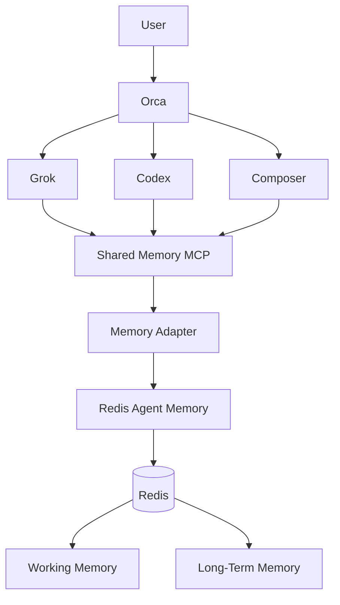

# Shared Agent Memory

Memória agnóstica de modelo e isolada por projeto para Orca, Codex, Grok e Cursor
Composer. Os agentes usam uma interface MCP autenticada; a implementação oculta o
Redis Agent Memory atrás da costura `AgentMemoryProvider`.

> **CÓDIGO FONTE > MEMÓRIA**
>
> O repositório é a fonte da verdade. A memória compartilhada oferece conhecimento
> histórico e contextual. Se divergirem, confie no repositório atual, verifique se a
> memória está obsoleta e atualize ou substitua o registro.

## Arquitetura



As responsabilidades permanecem separadas:

- A Orca cuida de runs, tarefas, dispatch, estado dos workers e coordenação.
- Git e o repositório detêm a verdade da implementação atual.
- O Redis Agent Memory detém o conhecimento contextual persistente.
- `shared-memory` define o protocolo de recall/gravação/handoff.
- O MCP oferece uma interface comum independente de modelo.

O módulo de aplicação expõe uma interface pequena `AgentMemoryProvider`. O
`RedisAgentMemoryAdapter` atual mapeia para o contrato REST legado V0. Os agentes
nunca veem chaves Redis, comandos Redis, endpoints V0 nem nomes de ferramentas
específicos do provedor. Um adaptador futuro Redis Iris pode substituí-lo sem
alterar a configuração MCP dos agentes nem a skill global.

## Status do provedor e versões

Verificado em 2026-08-25/26:

| Superfície | Versão fixada/verificada | Uso pretendido |
|---|---:|---|
| Redis Agent Memory Data Plane | OpenAPI `1.0.0` | Contrato Cloud/Iris suportado atual |
| Redis Agent Memory Python SDK | `redis-agent-memory 0.2.1` beta | Referência de cliente gerenciado |
| OSS Agent Memory Server | `0.15.2` | Apenas desenvolvimento local; base V0 |
| Ollama | `0.32.5` | Geração e embeddings locais |
| Modelo de geração | `qwen3:8b` | Extração/sumarização local |
| Modelo de embedding | `nomic-embed-text` | Vetores semânticos locais 768d |
| MCP TypeScript SDK | `1.30.0` | MCP Streamable HTTP compartilhado |
| Node.js | `>=20`; imagem `24.18` | Runtime do adaptador/MCP |

A stack Compose fixa deliberadamente o V0 `0.15.2`. O Redis não posiciona mais o V0
como caminho de produção suportado. Produção deve usar Redis Iris/Cloud via
adaptador de provedor, TLS, gerenciador de segredos, rate limiting, política de rede e
autorização por store/agente do provedor. Veja o
[relatório de descoberta](docs/discovery/redis-agent-memory.md).

## Início rápido

Pré-requisitos: Docker Desktop, Node.js 20+, `jq`, `openssl` e Ollama. O
caminho local padrão não exige chave OpenAI. O wizard de setup inicia o
serviço Ollama do Homebrew quando disponível e baixa `qwen3:8b` e
`nomic-embed-text`.

Execute o setup interativo:

```bash
./scripts/setup-memory.sh
```

O wizard grava apenas um `.env` ignorado com modo `0600`, gera uma chave MCP
única por agente, pergunta qual workspace pode ser acessado, cria grants de escopo
explícitos, sobe a stack após confirmação e verifica saúde. Nunca imprime
valores de segredo. Para configurar manualmente:

```bash
cp .env.example .env
# Substitua cada placeholder em .env; chmod 600 .env
docker compose -f docker-compose.memory.yml --env-file .env up -d --build
./bin/memory health
```

`docker compose down` preserva `agent-memory-redis-data`. Nunca automatize
`down -v`; remover o volume apaga a memória persistente.

Os containers Agent Memory alcançam o Ollama do host via
`host.docker.internal:11434`. A geração usa `ollama/qwen3:8b`; a busca semântica
usa `ollama/nomic-embed-text` com índice dedicado de 768 dimensões chamado
`memory_records_ollama_768`. O índice anterior de 1536 dimensões não é
apagado nesta migração. OpenAI permanece fallback opcional explícito:
altere as variáveis de modelo e forneça `OPENAI_API_KEY` apenas se escolher.
Veja o [relatório de compatibilidade de provedores](docs/discovery/opencode-provider-compatibility.md).

## Comandos para desenvolvedores

```bash
./bin/memory up
./bin/memory down
./bin/memory status
./bin/memory health
./bin/memory doctor
./bin/memory search <workspace> <project> <namespace|*> <query>
./bin/memory inspect <workspace> <project> <namespace|*> <query>
./bin/memory clear-session <workspace> <project> <namespace> <session>
```

`memory doctor` executa uma sonda explícita de busca semântica, detectando falhas
de conectividade de embedding/modelo que um endpoint de liveness não detecta. A
sonda é somente leitura mas invoca o provedor de embedding configurado uma vez; com
os padrões, a chamada permanece no Ollama local.

A API Agent Memory de baixo nível e o Redis não são publicados no host. Apenas o
endpoint MCP é mapeado, em `127.0.0.1:8787/mcp` por padrão. Comandos de operador
search/inspect/clear também passam pelo MCP autenticado usando a chave Orca do
`.env` ignorado; não contornam política via REST.

## Ferramentas MCP

A interface estável é intencionalmente mais alto nível que as ferramentas V0:

- `memory_search`, `memory_context`, `memory_get_project_context`
- `memory_remember`, `memory_update`, `memory_forget`
- `memory_store_decision`, `memory_search_decisions`
- `memory_get_working`, `memory_set_working`, `memory_clear_working`
- `memory_create_handoff`, `memory_get_latest_handoff`
- `memory_health`

O provedor V0 mapeia isso para os equivalentes REST documentados de
memória de trabalho e longo prazo. Os nomes MCP V0 oficiais
(`set_working_memory`, `create_long_term_memories`,
`search_long_term_memory`, `get_long_term_memory`,
`edit_long_term_memory`, `delete_long_term_memories`, `memory_prompt`) não são
expostos aos agentes e não são assumidos para Redis Iris.

## Integração de agentes

Todos os agentes apontam para o mesmo endpoint e usam uma chave Bearer distinta. O servidor
deriva `agentId` da chave, rejeita impersonação e autoriza cada
workspace/projeto contra `MEMORY_AGENT_GRANTS_JSON`. Autenticação sozinha não
concede acesso a projetos arbitrários.

### Codex

A entrada MCP global do Codex é instalada como `shared_memory` e lê o token
de `SHARED_MEMORY_CODEX_KEY`:

```bash
codex mcp get shared_memory
```

Inicie uma sessão nova do Codex após carregar a variável. Nenhuma chave é armazenada em
`~/.codex/config.toml`.

No macOS, o template LaunchAgent versionado carrega cada
`SHARED_MEMORY_*_KEY` do `.env` protegido no ambiente launchd por usuário no login. Instale com:

```bash
install -m 600 launchd/com.guidev.shared-memory-env.plist \
  ~/Library/LaunchAgents/com.guidev.shared-memory-env.plist
launchctl bootstrap "gui/$(id -u)" \
  ~/Library/LaunchAgents/com.guidev.shared-memory-env.plist
```

O plist e o loader não contêm valores de chave. O loader rejeita `.env`
simbolicamente linkado, proprietário inesperado ou permissões diferentes de `0600`. Encerre a Orca
completamente e reabra pelo Finder após a instalação para novas sessões herdarem
o ambiente launchd.

### Cursor / Composer

`~/.cursor/mcp.json` contém uma entrada `shared_memory` com:

```json
{
  "url": "http://127.0.0.1:8787/mcp",
  "headers": {
    "Authorization": "Bearer ${env:SHARED_MEMORY_COMPOSER_KEY}"
  }
}
```

Reinicie o Cursor após carregar a variável. Entradas MCP existentes e seus
headers são preservados.

### Grok

O link da skill global é instalado em `~/.grok/skills/shared-memory`, mas este
Mac atualmente não tem executável `grok` nem schema localmente comprovado para
`mcpBoxServers` em `~/.grokbot/settings.json`. Não invente esse schema. Instale o
Grok CLI compatível com Orca, confirme o formato atual de configuração MCP e
aponte para o mesmo endpoint com `SHARED_MEMORY_GROK_KEY`. Até então, sessão real
Grok é gate explícito de aceite.

### Orca

A Orca lança Codex, Cursor e Grok e descobre a fonte universal de skills em
`~/.agents/skills`. A skill `shared-memory` faz bootstrap e commit de memória no
nível do protocolo do agente. O banco SQLite de orquestração da Orca,
arquivos de runtime e hooks de status gerenciados permanecem intocados.

Reinicie a Orca antes de validação ao vivo: a descoberta encontrou bootstrap/runtime
obsoleto. Não reutilize a porta `6768` ocupada pela Orca para memória.

## Namespaces e isolamento

Cada operação inclui `workspaceId`, `projectId` opcional, `namespace`,
`sessionId` e `agentId` autenticado; IDs de run/tarefa/feature são anexados
quando disponíveis. Um filtro no provedor é seguido por verificação de projeto no
adaptador, para que resposta ruim do backend não cruze escopo de projeto silenciosamente. Chaves de
memória de trabalho também vinculam namespace e identidade do agente. `*` é aceito
apenas para leituras, nunca para gravações ou exclusões.

Layout lógico recomendado:

```text
global/{engineering,preferences,tooling,conventions}
projects/<project>/{architecture,frontend,backend,database,security,
                    integrations,api-contracts,decisions,bugs,handoffs}
```

Use memória global apenas para conhecimento genuinamente cross-project. Regras permanecem
instruções; memória permanece conhecimento aprendido.

## Ciclo de vida e orçamento de contexto

A memória de trabalho é escopada à sessão e usa `MEMORY_WORKING_TTL_SECONDS` (padrão
6 horas). Registros de longo prazo são atômicos e persistem até serem substituídos,
depreciados, esquecidos ou removidos por política de retenção explícita do provedor.

O recall usa busca do provedor, filtros obrigatórios de metadados, limiar de relevância,
limite de resultados e orçamento final de tokens:

```text
provider candidates -> project/namespace/type/status filters
                    -> MEMORY_MIN_RELEVANCE
                    -> MEMORY_MAX_RESULTS
                    -> MEMORY_MAX_CONTEXT_TOKENS
```

Registros carregam status `active`, `superseded` ou `deprecated`. `memory_update`
cria o substituto e vincula o registro anterior com `supersededBy`.
Quando `sourceCommit` difere do commit atual do chamador, o recall marca o
registro como `possiblyStale`; o agente deve verificar no Git.

## Segurança

- Chaves Bearer únicas por agente; nenhuma identidade de agente vem do conteúdo da memória.
- Autenticação pode ser desabilitada apenas em listener loopback para testes/dev
  local. O Compose mantém habilitada no MCP.
- Redis é privado à rede Docker e não tem porta no host.
- Grants explícitos por agente de workspace/projeto autorizam cada chamada de ferramenta com escopo.
- Varredura de segredos cobre título, conteúdo e metadados persistidos, rejeitando chaves de provedor, tokens JWT/Bearer, chaves AWS, cookies,
  chaves privadas, URLs com credenciais, senhas, tokens OAuth/GitHub e atribuições comuns de
  segredo antes de chamadas ao provedor.
- Padrões persistentes de prompt injection e instruções arbitrárias de comando são
  rejeitados antes de gravações.
- Conteúdo externo permanece `external` ou `unverified`; um agente não pode forjar
  outro agente como proveniência. Agentes MCP também não podem auto-afirmar `user` ou
  `trusted`; esse nível é reservado a um caminho de aprovação autenticado separado no futuro.
- Registros do provedor são validados por schema em runtime e varridos novamente no
  recall; envelopes legados malformados ou envenenados são descartados.
- Payloads e headers de autorização são excluídos de logs estruturados.
- Schemas de entrada limitam identificadores, metadados, arrays, tamanho de conteúdo e contagem de
  resultados.
- Requisições usam timeouts, retries exponenciais limitados e circuit breaker.
  Falha do provedor degrada memória sem invalidar trabalho no repositório.
- Chamadas MCP têm limitador configurável por IP
  (`MEMORY_RATE_LIMIT_PER_MINUTE`, padrão 120); proxies de produção devem passar política
  confiável de endereço do cliente.

Para produção, termine TLS antes do MCP, use grants de store/agente Redis Iris,
coloque chaves em gerenciador de segredos real, restrinja ingress e adicione rate limiting no
proxy confiável. V0 `DISABLE_AUTH=true` é aceitável apenas na rede backend privada do
Compose; a API não é exposta.

## Observabilidade

O MCP grava nomes de eventos estruturados sem payloads completos de memória. O runtime
atual emite os eventos (contadores específicos de update/dedup planejados apenas quando o serviço retorna
outcome explícito):

```text
memory.search memory.hit memory.miss memory.write memory.rejected
memory.handoff memory.health memory.mcp_error
```

`GET /health` retorna status e latência MCP/provedor/Redis; o adaptador local
verifica Redis independentemente com `PING` RESP autenticado quando `REDIS_URL`
está configurado. `GET /metrics`
exporta contadores locais do processo e latência total de operação em formato texto
Prometheus. Deployments de produção devem fazer scrape por caminho de observabilidade
protegido em vez de expor publicamente.

## Verificação

```bash
npm ci
npm run lint
npm run typecheck
npm run build
npm run test:unit
npm run test:integration  # abre listener efêmero 127.0.0.1
npm run test:e2e
```

A simulação E2E determinística usa um provedor compartilhado por controladores distintos Grok,
Codex e Composer. Valida o fluxo de decisão/contrato e consulta zero-leak ao projeto B, mas não é o teste de aceite real A-E obrigatório.
Testes de integração cobrem o protocolo MCP Streamable HTTP real e serialização REST
V0. `scripts/live-working-memory-smoke.mjs` prova o caminho vivo
MCP -> V0 -> Redis de memória de trabalho com a stack rodando;
`scripts/live-long-term-smoke.mjs` grava, recupera semanticamente e remove
uma decisão temporária via embeddings Ollama e busca híbrida de decisões.
Extração de worker e sessões reais separadas de agentes ainda exigem a stack
Compose, modelos Ollama locais, Grok instalado e sessões novas de clientes; não
marque esses gates como completos antes.

## Solução de problemas

- `listen EPERM ... 127.0.0.1`: o sandbox bloqueia listeners locais; rode a
  suíte de integração onde listeners loopback são permitidos.
- `memory provider circuit is open`: verifique `./bin/memory health`, logs API/worker,
  disponibilidade Ollama/modelo e Redis antes de tentar após o cooldown.
- MCP unauthorized: carregue a `SHARED_MEMORY_<AGENT>_KEY` correta, reinicie o
  cliente e mantenha o nome da variável de ambiente Bearer configurada.
- Cursor não vê ferramentas: reinicie após carregar a variável de ambiente;
  inspecione logs MCP do Cursor sem imprimir valores de header.
- Dados Redis sumiram: confirme que o volume nomeado ainda existe. `down` mantém
  ele; `down -v` apaga.
- Busca híbrida indisponível após migrar para Iris: Redis Iris Data Plane 1.0.0
  documenta busca semântica, não opções keyword/híbridas do V0. Use descoberta de
  capacidades do provedor e não prometa modos não suportados.
